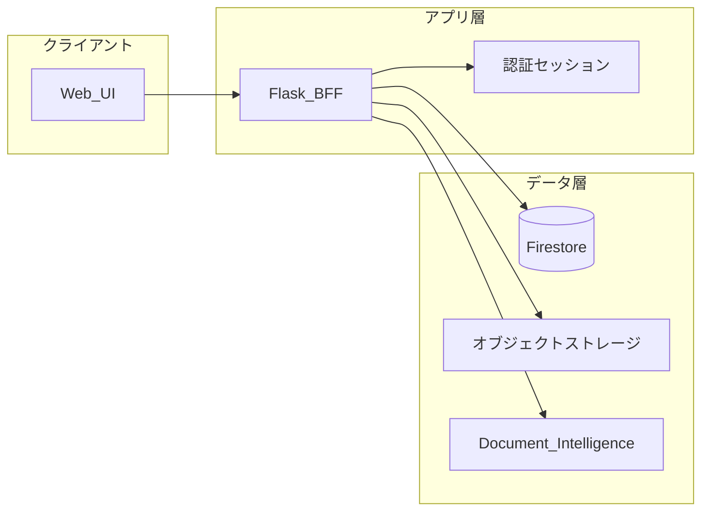

## 1. 設計の前提（合意しておきたい3点）

- **勝ち筋**: 「機能の多さ」ではなく **迷わない導線・言葉・失敗しても戻れる安心感** と、**AIは“説教”ではなく“伴走”**。
- **技術的トレードオフ**: いまは Flask + Firestore で速度優先でよい。SaaS化するときに効くのは **「誰のデータか」を最初から一貫したキー設計** と **境界（BFF/認可）の置き方**。
- **複雑なAPI連携は捨てる** = 外部は **認証・課金・通知・OCR** に絞り、アプリ内ロジックは薄く保つ。

---

## 2. データの流れ（インフラ屋向けの一枚絵）

ざっくり **3レイヤ** で語ると腹落ちしやすいです。

- **書き込みの主経路**: UI → Flask（BFF）→ Firestore（正本）／レシートは OBJ に置き **Firestore にはメタ＋OCR結果の要約**。
- **OCR**: 画像は **署名付きURL or サーバ経由の一時ストリーム** → Document Intelligence。**生テキスト全文を無制限にFirestoreに入れない**（サイズ・PII・コスト）。
- **マルチテナントの心臓**: すべてのドキュメントに **`tenant_id`（将来）/ 現状は `family_id`）** を必須で持たせ、クエリは **必ずテナント条件付き**（将来の誤参照・漏えい対策の土台）。

「スケールを見据えた一工夫」としては:

- **テナントIDを “人” ではなく “契約単位（workspace / household）” に寄せる**（家族招待・退会・データ引き継ぎが楽）。
- **課金単位とデータ単位を一致**させる（後からの請求・データエクスポートが地獄にならない）。
- **監査ログは別系統**（誰がいつ何をしたかは、本番SaaSでは別ストア or ログ基盤に流す想定で設計メモだけでも残す）。

---

## 3. フロント／バックの「大まかな設計図」

- **Phase 1〜2（単一プロダクト・単一デプロイ）**  
  - **サーバーサイドレンダリング中心（今の延長）**でOK。  
  - 「シンプルUX」と相性が良い。  
  - APIは **JSONは補助**（チャート・OCR進捗・クイック登録程度）に留めると複雑度が増えにくい。

- **Phase 3以降（マルチテナントSaaS）**  
  - 認証を **IdP寄せ**（Firebase Auth / Entra B2C 等は候補。選定は「主婦・学生が迷わないログイン」優先）。  
  - Flaskは **BFF** として残しつつ、**課金Webhook・メール**はマネージドに寄せる。  
  - フロントが肥大化したら **HTMX的な部分更新** か、**管理画面だけSPA** など **段階的分離**（いきなり全面SPAはコスト高）。

---

## 4. ロードマップ案（Phaseごと）

### Phase 1 — 「一人・一家族で毎日使える核」

- **体験**: 収支入力・一覧・レシート「撮る→確認→1件登録」まで **3クリック以内**を目安に磨く。  
- **データ**: `transactions` / `receipts` / `users`・`families` の **スキーマを文書化**（フィールド意味・PIIフラグ）。  
- **AI**: 月次アドバイスは **短く・行動1つ**（例: 「来週だけ外食1回減らす？」）。  
- **非機能**: エラー時メッセージの言葉遣い、オフライン時の挙動メモ。

**成果物**: 「デモで説明できるプロダクト核」＋スキーマ1枚。

---

### Phase 2 — 「信頼と運用」（インフラ屋が笑顔になるゾーン）

- **セキュリティ**: 秘密情報の置き場所統一（本番は **Secret / Key Vault**、ローカルだけ `.env`）。  
- **オブザーバビリティ**: 構造化ログ、**OCR失敗率・レイテンシ**、**Firestore読み書き回数**のざっくり可視化。  
- **バックアップ/エクスポート**: 「データは自分のもの」という安心のため **CSVエクスポート**や将来の **テナント単位エクスポート**の設計だけ先に決める。  
- **コスト**: Document Intelligence の **F0/S0境界**、画像サイズ上限、再解析ボタンの **レート制限方針**（仕様メモで可）。

**成果物**: 本番に近い運用設計メモ＋最低限の監視。

---

### Phase 3 — 「マルチテナントSaaSの骨格」

- **テナント**: `tenant_id` 全コレクション付与、**招待・ロール（オーナー/メンバー/閲覧のみ）**。  
- **課金**: Stripe等想定で **tenant と subscription_id の紐付け**、Webhookで状態同期。  
- **分離レベル**: 最初は **論理分離（Firestore + 強いセキュリティルール）** で十分。需要が出たら **プロジェクト分割やDB分割** を検討（今は決め打ち不要、**逃げ道だけ言語化**）。

**成果物**: テナントモデル図＋課金フロー図（手書きレベルでOK）。

---

### Phase 4 — 「伸ばす」

- 銀行連携は **やらない or 最後**（複雑さとサポートコストが跳ねる）。代わりに **音声メモ→1行取引** など、ターゲットに効く簡単AI。  
- パートナー連携は **Webhook/CSVインポート** 程度に限定。  
- 法人・士業向けは **別ライン**（UXが別物になるため）。

---

## 5. 今夜のすり合わせチェックリスト（寝る前にYes/Noだけ）

1. **テナントの単位**は「家族＝1ワークスペース」で固定でよいか。  
2. **レシート**は「1レシート＝原則1取引」で当面よいか（明細は表示用・将来は複数取引もあり得る）。  
3. **AIの位置づけ**は「意思決定は人・AIは提案のみ」でブランドを固定するか。  
4. **次の2週間の最優先**は「OCR確認UX」と「取引一覧の体験」どちらを先に磨くか。

---

ここまでが「コードなし」のロードマップ案です。明日、上の4点についてあなたの答えをもらえれば、Phase 1 のスプリントを **具体的なバックログ（画面単位）** に落とし込めます。おやすみなさい。
